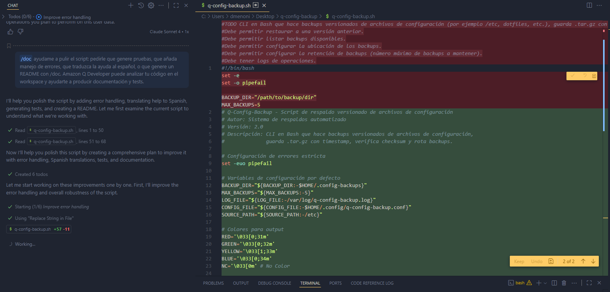

# Q-Config-Backup

**Q-Config-Backup** es una herramienta CLI en Bash que permite realizar **backups versionados de archivos de configuración** (ejemplo: `/etc`, dotfiles, etc.).  
Los respaldos se guardan en archivos `.tar.gz` con **timestamp**, se valida su integridad con **checksum SHA256**, y se realiza **rotación automática** de backups antiguos.

---

## 📸 Capturas de Pantalla

### Conversación con Amazon Q Developer
<!-- Inserta aquí tu captura de pantalla con la conversación de Amazon Q Developer -->


### Script en acción
<!-- Inserta aquí la captura de pantalla de tu script ejecutándose -->


---

## 🚀 Features

- **Versioned Backups:** Archivos con marca temporal.  
- **Checksum Verification:** Verificación de integridad usando SHA256.  
- **Backup Rotation:** Elimina automáticamente los respaldos más viejos, manteniendo solo la cantidad configurada.  
- **Configurable:** Opciones de directorio de destino, ruta origen y número máximo de backups.  
- **Logging:** Registro de operaciones en un archivo de log.  
- **Restore:** Permite restaurar configuraciones desde un backup específico.  

---

## 🛠️ Uso

```bash
./q-config-backup.sh [OPCIONES] [COMANDO] [ARGUMENTOS]

